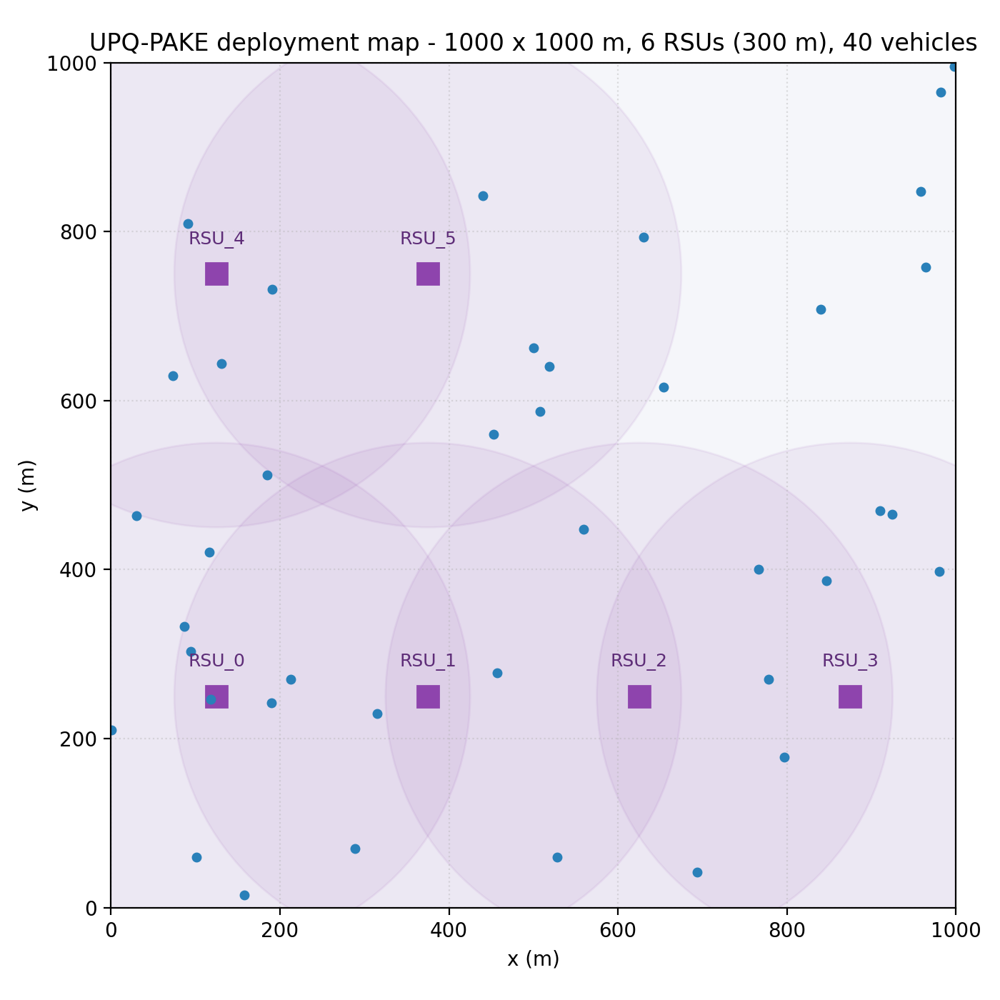
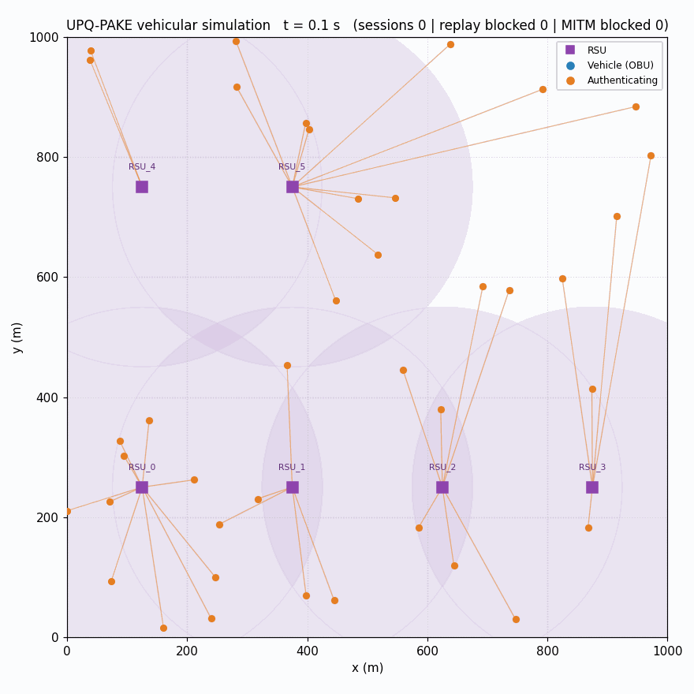
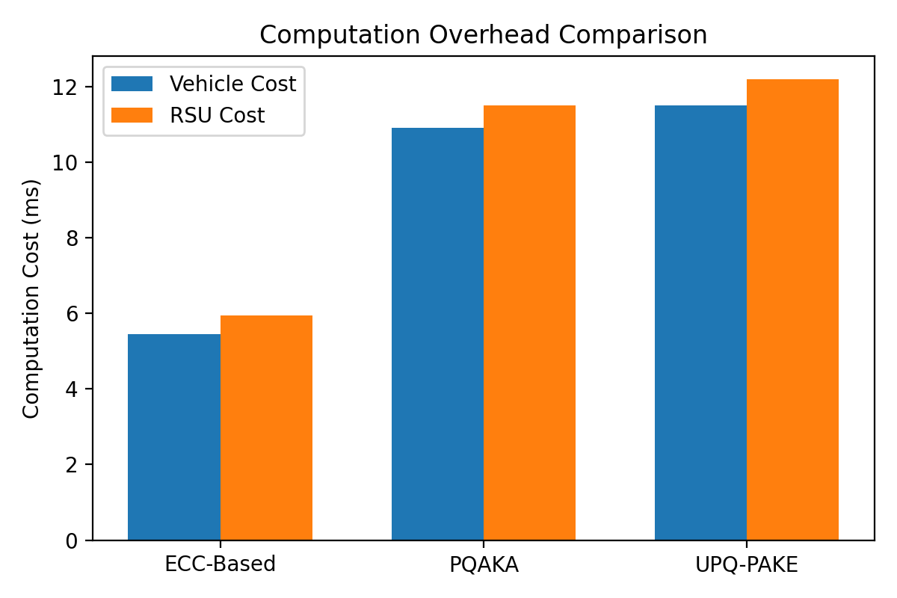
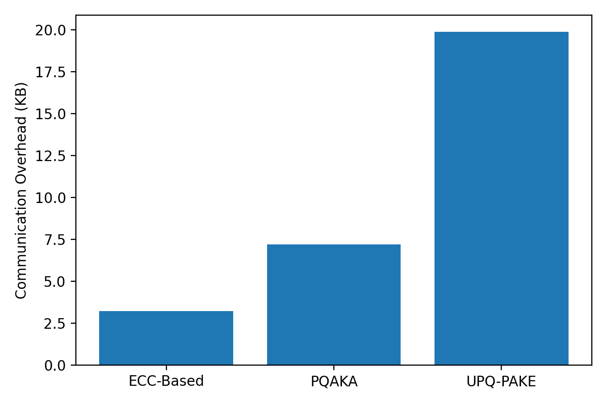
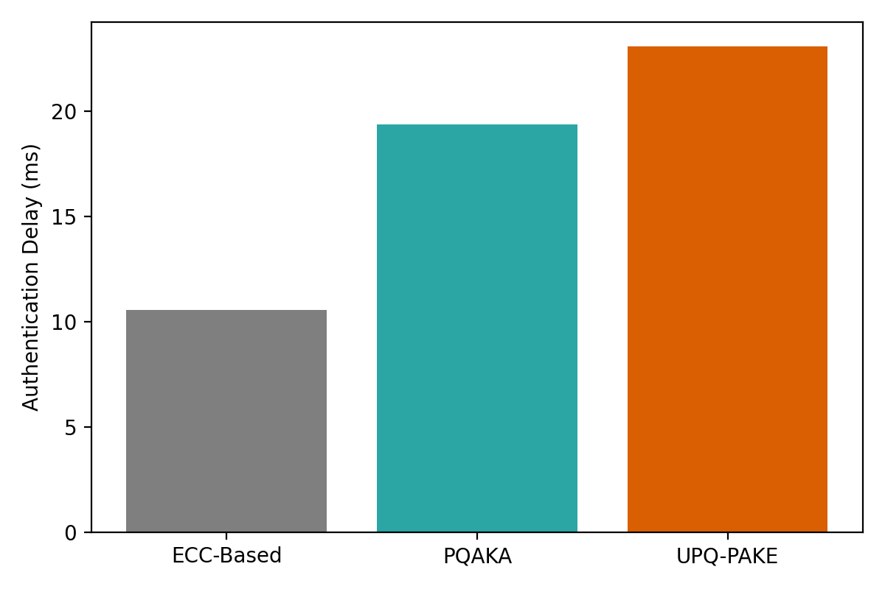
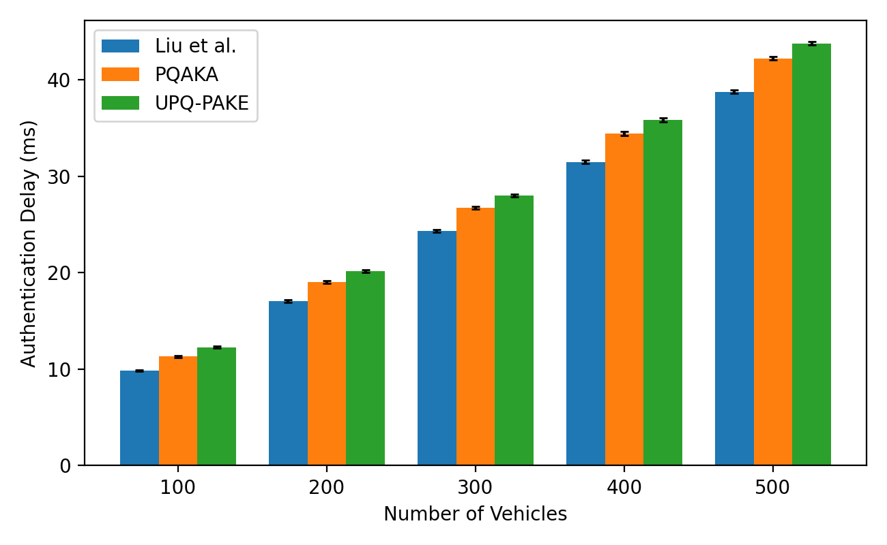

# Autonomous UPQ-PAKE: Quantum-Resistant Vehicular Network Scheme

A unified post-quantum pseudonymous authentication and key-establishment (UPQ-PAKE) scheme for secure Vehicle-to-Infrastructure (V2I) communication in Intelligent Transportation Systems (ITS).

**Authors:** Rabia Khan (Kohat University of Science & Technology, Pakistan), Syed Usman Jamil (Edith Cowan University, Australia), Md. Abdur Rahman (University of Prince Mugrin, Madina, KSA), Leslie F. Sikos (Edith Cowan University, Australia), Nadia Jamil (Immigration & Passport, Islamabad, Pakistan), Selwa A. F. Al-Hazzaa (KACST, Riyadh, KSA), Abdulhakim Sabur (Taibah University, Madinah, KSA)

**Correspondence:** Abdulhakim Sabur — asabur@taibahu.edu.sa

Submitted to *Symmetry* (MDPI), 2026.

---

## Introduction

Vehicular networks rely on continuous V2V/V2I message exchange for traffic safety, but conventional ECC/RSA-based authentication is broken by quantum adversaries via Shor's algorithm. This repository presents **UPQ-PAKE**, a scheme that combines dynamic session-specific pseudonyms, NIST-standardized post-quantum primitives (**ML-DSA-65** for signatures, **ML-KEM-768** for key encapsulation), and a single transcript-bound authenticated key exchange to deliver mutual authentication, dual-directional session-key establishment, forward secrecy, and unlinkability suitable for large-scale, real-time IoV deployments.

## Contributions

1. A unified post-quantum pseudonymous authentication and key-establishment framework for secure IoV communications.
2. A dynamic, session-specific pseudonym generation mechanism that strengthens identity privacy, unlinkability, and resistance to vehicle tracking.
3. A dual-ephemeral ML-KEM-based authenticated key-establishment protocol that contributes entropy from both parties for strong forward secrecy.
4. A transcript-bound authentication mechanism that cryptographically binds all session parameters to resist man-in-the-middle and replay attacks.
5. A formal security analysis under the Quantum Polynomial-Time (QPT) adversarial model, covering session-key indistinguishability, mutual authentication, identity privacy, and forward secrecy.

## System Model

The protocol involves three roles:

| Entity | Role |
|---|---|
| **Trusted Authority (TA)** | System initialization, vehicle/RSU registration, credential issuance, revocation (CRL) — fully trusted, off the real-time authentication path |
| **Roadside Unit (RSU)** | Semi-trusted; verifies vehicle credentials and establishes session keys via ML-KEM/ML-DSA |
| **Vehicle (OBU)** | Holds a pool of TA-issued, short-lived, single-use pseudonym credentials; authenticates to RSUs it passes |

Direct V2V authentication is out of scope of the base protocol and noted as a future extension.

## Protocol Overview (6 phases)

1. **Vehicle Registration & Pseudonym Provisioning** — TA issues a pool of short-lived pseudonym credentials `PCert_V^(j)`, each binding a fresh session pseudonym `PID_V^(j) = H(PID_V ‖ η_j)` to the vehicle's verification key.
2. **Vehicle Authentication Request** — vehicle picks an unused credential, generates an ephemeral ML-KEM key pair, a nonce and timestamp, and signs the request with ML-DSA.
3. **RSU Verification & Response** — RSU validates the TA signature, credential status, and vehicle signature/freshness; encapsulates its own ML-KEM shared secret; computes and signs the transcript binder `β_R`.
4. **Vehicle Verification & KEM Contribution** — vehicle verifies the RSU signature, decapsulates, contributes its own encapsulation, extends the transcript binder `β = H(β_R ‖ ct_{V→R})`, and signs it.
5. **RSU Verification & Session-Key Derivation** — both sides derive `K_sess = HKDF(ss_{R→V} ‖ ss_{V→R} ‖ H(Auth_V) ‖ β)`.
6. **Secure Erasure & Credential Update** — ephemeral secrets are erased; the used pseudonym credential is retired and never reused.

## Security Properties (formally analyzed)

| Property | Basis |
|---|---|
| Quantum resilience | IND-CCA security of ML-KEM, EUF-CMA security of ML-DSA |
| Mutual authentication | Bidirectional ML-DSA transcript verification |
| Dynamic unlinkability | Fresh session pseudonym per session, negligible collision probability |
| Forward secrecy | Dual-ephemeral ML-KEM contribution from both parties |
| Replay resistance | Nonce uniqueness + timestamp freshness window |
| Transcript / MITM integrity | Single canonical transcript binder `β` covering all session parameters |

## Performance Summary (benchmark platform: Intel i7-12700, liboqs 0.14.0, ML-KEM-768 / ML-DSA-65, NIST Level 3)

| Metric | ECC-based | PQAKA | **UPQ-PAKE (proposed)** |
|---|---|---|---|
| Vehicle computation cost | ~4.9 ms | ~10.6 ms | **~11.5 ms** |
| RSU computation cost | ~5.3 ms | ~11.4 ms | **~12.2 ms** |
| Communication overhead | ~3.2 KB | ~7.2 KB | **19.88 KB** |
| Authentication delay | ~9.5 ms | ~18.7 ms | **~22.8 ms** |
| Scalability delay (100→500 vehicles) | — | — | **12.5 → 44.0 ms** |

The added cost reflects the security–performance trade-off of quantum-resistant mutual authentication, dual-directional key establishment, and full transcript binding — see the paper's Sections 6.2–6.5 for the full derivation.

## Comparison with Related Work (condensed from Table 1)

| Scheme | Quantum Resistant | Dynamic Unlinkability | Transcript Binding | Dual Ephemeral Entropy | Formal Security Analysis |
|---|:---:|:---:|:---:|:---:|:---:|
| ECC/PKI-based [34] | ✗ | ✓ | ✗ | ✗ | ✓ |
| Lattice-based [2] | ✓ | ✗ | ✗ | ✓ | ✓ |
| PQAKA [12] | ✓ | ✗ | ✓ | ✗ | ✓ |
| **UPQ-PAKE (ours)** | **✓** | **✓** | **✓** | **✓** | **✓** |

## Repository Structure

```
README.md                    This file — paper summary and results
simulation_docs/             Extended simulation methodology & reproduction notes
upqpake_sim/                 Simulation package
  pq.py                      ML-KEM-768 / ML-DSA-65 wrappers, SHA3-256, HKDF-SHA3
  protocol.py                Algorithm 2 implementation (TA, Vehicle, RSU classes)
  baselines.py                ECC & PQAKA operation profiles, byte-exact packets
  network.py                 Discrete-event scalability simulation (Fig. 6)
  attacks.py                 Replay / MITM / pseudonym-linking attack simulation
  visual_sim.py               Live environment: map, RSUs, vehicles, sessions
run_simulation.py            Reproduces Figures 3–6, CSVs, summary.txt
run_environment.py           Live visual demo + parameter sheet + map
results/                     Generated figures, CSVs, event logs, animation frames
requirements.txt
```

## Reproducing the Results

```
python3 -m venv venv_automis
source venv_automis/bin/activate      # Windows: venv_automis\Scripts\activate
pip install -r requirements.txt

python run_simulation.py     # Figures 3-6 + CSVs + summary
python run_environment.py    # frames + GIF + event log + parameters
```

See `simulation_docs/SIMULATION_README.md` for the full methodology, what is executed for real versus modelled/calibrated, and a side-by-side table of reproduced values against the paper's reported figures.

## Simulation Results





| Computational Overhead | Communication Overhead |
|---|---|
|  |  |

| Authentication Delay | Scalability Delay |
|---|---|
|  |  |

## Funding

This work is derived from a research grant funded by Taibah University, Madinah, Kingdom of Saudi Arabia (grant number 448-16-1216).

## Conflict of Interest

No conflict of interest.

## Acknowledgments

We thank all collaborators and institutions contributing to this research work.

## References

[2] Rajasekaran, A.S.; Das, A.K.; Maria, A.; Ahmed, G.F.; Merlec, M.M.; In, H.P.; Pal, S. PQ-AuthV: Post-Quantum Secure Authentication with Aggregated Signatures in IoT-Enabled Smart Vehicle Networks. *IEEE Internet of Things Journal* 2026, 13. https://doi.org/10.1109/JIOT.2026.3688913

[12] Raja, G.; Theerthagiri, S.; Raja, K.; Ramanujam, J.A.; Sadhasivam, T.; Vasudevan, P.; Arumugam, P.; Khowaja, S.A.; Dev, K. PQAKA: Post Quantum Authentication and Key Agreement Protocol for Intelligent Internet of Vehicles over 5G. *IEEE Open Journal of the Communications Society* 2026, 7, 196–210. https://doi.org/10.1109/OJCOMS.2025.3643607

[34] Liu, Z.; Yao, N.; Bai, S.; et al. A Cooperative ECC-Based Authentication Protocol for VANETs. *Scientific Reports* 2025, 15, 40837. https://doi.org/10.1038/s41598-025-24663-8
